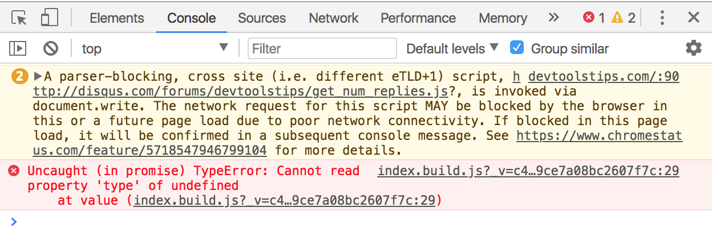
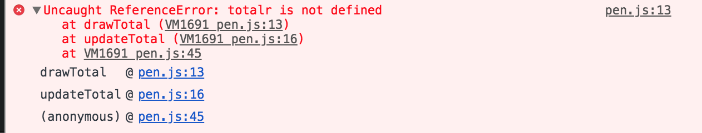
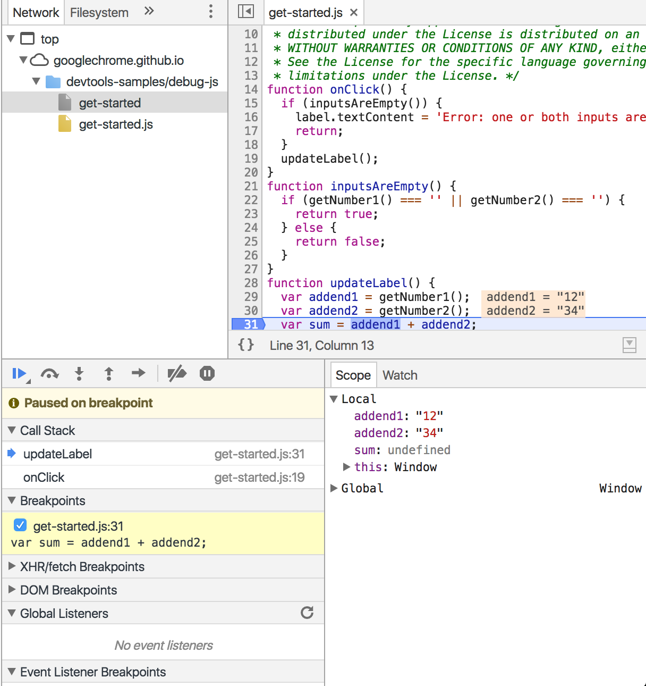

# Taller de debugging en JavaScript


## Introducción

**Debugging** es el proceso de encontrar y eliminar errores en piezas de software. Literalmente significa quitar "bichos" o "bugs". Puede sonar un poco raro, pero en los programas de software, sobre todo los complejos, *siempre* hay errores. Es decir, que por mucho esfuerzo que hagamos para que nuestro programa no tenga errores, siempre habrá casos límite o condiciones que hagan que nuestro programa falle. Por tanto, vamos a tener que asumir que siempre habrá errores y vivir con ello, y tener siempre una herramienta donde tener un listado de errores (o *issues*) por solucionar.

Los errores se introducen en nuestro programa por muy diversas causas. Ya sea por desconocimiento del lenguaje y sus peculiaridades. Y por desconocimiento de otras herramientas o librarías usadas en nuestro programa. Por otro lado, podemos introducir errores también por no entender bien los requisitos de la aplicación, sucediendo esto mucho más a menudo de lo que se pudiera esperar. A veces el propio dominio del problema tiene mucha complejidad, o aunque no sea muy complejo el desarrollador siempre puede tener despistes de forma habitual o puntual por tema de cansancio.


Muchas veces estos errores pueden venir, no del mismo programa sino del **contexto donde se ejecuta**. Por ejemplo, nuestro servidor puede quedarse sin memoria y afectar a nuestro programa. O tener un error de hardware. O desconectarse de Internet.

En este taller vamos a centrarnos en errores de código comunes en JavaScript y cómo solucionarlos. Cuando encontramos un error cuando estamos desarrollando un programa, siempre pensamos que es algo malo. Pero no es así: cuando encontramos un error es positivo ya que estamos detectando este error nosotros y no un cliente de nuestro servicio. Además, los errores que aparecen en la consola son algo bueno porque nos dan muchas pistas de dónde viene el error y cómo solucionarlo. ¡Solo tenemos que hacer un pequeño esfuerzo por leer el error y entenderlo!




## ¿Para qué sirve lo que vamos a ver en este taller?

En esta sesión vamos a apreder principios básicos para detectar y solucionar errores en nuestro código JavaScript. Por tanto, estas habilidades las estaremos usando constantemente cuando estemos desarrollando software.

Pero, ¿podemos solucionar los errores antes de que se manifiesten? **¡Claro!** No es el objetivo de este taller, pero podemos utilizar distintas estrategias para prevenir la aparición de errores (*bugs*) en nuestro código. Una de ellas es precisamente el uso de herramientas de testing que aprendimos en el taller anterior. Al realizar un código bien testeado, estamos previniendo que aparezcan muchos errores. Además, una buena estructura del código y el hecho de estar probando el código constantemente también son formas de prevenir errores y que son consecuencia de testear nuestro código (nos referimos a tener tests automáticos).

## ¿En qué casos se utiliza?

Como hemos contado antes, siempre vamos a tener errores en nuestra aplicación, de mayor o menor gravedad. Así que vamos a tener que usar técnicas de debugging constantemente para solucionar esos errores.

En el taller vamos a centrarnos en cómo solucionar errores que ya hemos detectado. La detección de errores, por tanto, queda fuera del ámbito de este taller.

## Pasos para solucionar errores

> **¡Tenemos un error!** ¡Por lo menos! OMFG! ¿Qué hacemos para solucionarlo?

En esta sección vamos a ver pasos a serguir para solucionar errores y en qué consiste cada uno.

1. **Reproducir el error**

  Para poder solucionarlo, tenemos que ser capaces de reproducir el error. Por ejemplo, el error puede suceder al arrancar la página, solo cuando hago clic en un botón, o solo la quinta vez que hago clic. Por tanto, tengo que tener claro qué pasos tengo que dar para que se reproduzca. Como hemos hablado antes, reproducirlo va a ser mucho más complicado si depende del contexto. Por ejemplo, un error de rutas que no tengo en local pero que aparece al subir mi código a un servidor.

2. **Aislar el error**

  Muchas veces podemos observar que tenemos un error pero no sabemos de dónde viene. Si es un error que se manifiesta en la consola, el paso natural es buscar el fichero y número de línea que ahí se indica. Pero a veces se dan situaciones más complicada. Por ejemplo, puede ser que el error sucede en una parte del programa pero debido a un fallo en otra parte. O que varios errores se manifiesten juntos. Para encontrar el origen del error cuando no sabemos de dónde viene es conseguir aislarlo.

  Para aislar un error que no sabemos de dónde viene, lo mejor es ir descartando errores más generales que podrían estar sucediendo. Por ejemplo, tenemos una aplicación de compra que al añadir un producto mediante un botón no actualiza la cantidad total. En este caso no tenemos un error en la consola que nos diga dónde buscar porque es un error de comportamiento de la aplicación. Vamos a ir aislando desde errores más generales a errores más concretos:
  1. Nos aseguramos que la web que estamos probando en el navegador corresponde al fichero fuente que estamos modificando; por ejemplo, escribiendo algo más en la página o haciendo un `console.log` nos aseguramos de estar viendo el resultado en el navegador del fichero fuente que creemos
  2. Buscamos la función JS que responde al evento de ese botón. Nos aseguramos que esa función se ejecuta.
  3. Buscamos el cálculo del nuevo precio, y comprobamos que es correcto
  4. Comprobamos que se pinta correctamente en el DOM

3. **Entender el error**

  Una vez que hemos identificado y aislado el error, es hora de entender por qué sucede. Antes de intentar solucionar el error es asegurarnos de entender por qué sucede. La razón va a depender mucho del error que sea, y en la siguiente sección del taller veremos algunos tipos de errores en JavaScript y herramientas para solucionarlos. Algo que nos puede ayudar bastante a entender cuándo y por qué sucede un error es el *stack trace*, es decir, el listado de las llamadas a funciones donde ha sucedido el error. En este ejemplo, el error sucede en la función `drawTotal`, que es llamada por `updateTotal` que a su vez es llamada desde una función anónima.

  

4. **Solucionar el error**

  Ya sabemos qué error está sucediendo y por qué: ya solo falta solucionarlo. Fácil de decir pero, en ocasiones, nada fácil de realizar. Toca desarrollar código para solucionar el problema. Muchas veces este paso nos cuesta más porque no acabamos de entender por qué sucede el error.

## Errores en JavaScript

Vamos a explorar algunos errores típicos de JavaScript. No vamos a ser exhaustivos, pero sí vamos a intentar cubrir los errores más comunes.

### Errores de sintaxis VS errores de ejecución

En esta primera clasificación de errores en JavaScript, podemos diferenciar entre errores de sintaxis y de ejecución.

Los **errores de sintaxis** son errores en la propia sintaxis del lenguaje JavaScript. Por ejemplo, esta expresión no es válida en Javacript `const i = ;` pero esta sí `const i = 0;`. Otros ejemplos son olvidar cerrar llaves `{}`, olvidar una coma `,` en un array o poner un `=` en lugar de `:` al definir un objeto. Para prevenir este tipo de errores podemos usar herramientas automáticas como los *linters*.

Los **errores de ejecución** son errores que no se deben al lenguaje en sí y que no pueden detectarse antes de ejecutar el código. Por ejemplo, en una función intentamos acceder a un parámetro pero quien la llama ha olvidado enviarlo y es `undefined`. También lo es olvidar la parte de actualización de un bucle y que se convierta en un bucle infinito. O acceder al contexto `this` en una función pero que se ejecute en un contexto que no esperamos.

### Errores típicos en JavaScript

1. **El error tipográfico (*typo*)**

  Uno de los errores más comunes es el error tipográfico. Estamos escribiendo alguna de las palabras del lenguaje, o de las variables que hemos declarado, y nos baila una letra.

  ***
  EJERCICIO 1

  Encuentra el error tipográfico en estos ejemplos.

  Ejemplo 1
  ```js
  const people = ['Mary', 'Sue', 'Angela'];

  console.log(people.lenght);
  ```
  Ejemplo 2
  ```js
  const button = document.querySelector('.send');

  button.addEvenListener('click', () => alert('Sent'));
  ```
  Ejemplo 3
  ```js
  const button = document.qerySelector('.send');

  button.addEventListener('click', () => alert('Sent'));
  ```
  ***

2. **Errores de variables**

  En nuestro programas siempre trabajamos con datos. Para guardarlo en JavaScript usamos variables. Algunos errores típicos al trabajar con variables:
  - trabajar con el tipo de datos equivocado
  - errores al asignar o reasignar
  - uso de `let` y `const`

  ***
  EJERCICIO 2

  Encuentra los errores al tratar con variables en estos ejemplos.

  Ejemplo 1
  ```js
  const total = 8;

  total += 1;
  ```
  Ejemplo 2
  ```js
  let total = document.querySelector('.total').innerHTML;

  total += 1;
  ```
  Ejemplo 3
  ```js
  let html = '';

  html = '<p>';
  html = 'Hola amigos';
  html = '</p>';

  document.querySelector('.greet').innerHTML = html;
  ```
  Ejemplo 4
  ```js
  let html = '';

  html += '<p>';
  html += 'Hola amigos';
  html += '</p>';

  const html = '<html>';
  ```
  ***

3. **Errores de estructuras de datos**

  Cuando manejamos estructuras de datos complejas, como arrays y objetos, también solemos encontrarnos con errores. Alguno típicos son
  - error en la inicialización
  - acceso a posiciones del array fuera de los límites

  ***
  EJERCICIO 3

  Encuentra los errores al tratar estructuras de datos en estos ejemplos.

  Ejemplo 1
  ```js
  const people;
  people.push('Ada');
  ```
  Ejemplo 2
  ```js
  const people = ['Ada', 'Borg', 'Clarke'];
  alert(people[3]);
  ```
  Ejemplo 3
  ```js
  const teacher = {
    name: 'Nasiba',
    color: 'purple',
    pets: ['gato']
  };
  alert(teacher['pets'][1]);
  ```
  ***

4. **Errores de funciones**
  Cuando trabajamos con funciones (que es casi siempre) también tenemos un listado de errores típicos:
  - definimos la función y no ejecutamos
  - ejecutamos la función con parámetros inadecuados

  ***
  EJERCICIO 4

  Encuentra los errores al trabajar con funciones.

  Ejemplo 1
  ```js
  const sayHello = () => alert('Hello');
  //No me sale nada en la pantalla!
  ```
  Ejemplo 2
  ```js
  const sayHello = name => alert(`Hello ${name}`);
  sayHello();
  ```
  Ejemplo 3
  ```js
  const sayHello = (age, name) => alert(`Hello, my name is ${name} and I'm ${age}`);
  sayHello('Ada', 35);
  ```
  ***

5. **Errores de null / undefined**
  Errores típicos cuando no manejamos valores nulos o indefinidos:
  - llamar a función que no existe
  - acceder a una propiedad de un objeto que no existe

  ***
  EJERCICIO 5

  Encuentra los errores al trabajar con valores nulos o no definidos.

  Ejemplo 1
  ```js
  const total = document.querySelector('.item').innerHTML;
  //No hay ningún .item en la página
  ```
  Ejemplo 2
  ```js
  const items = document.querySelectorAll('.item').innerHTML;
  ```
  Ejemplo 3
  ```js
  const item = {
    name: 'Lonchas de pavo',
    price: 2
  };
  alert(item.description);
  ```
  ***

6. **Errores en bucles**
  Errores típicos al trabajar con bucles son:
  - bucle infinito
  - cuando tengo bucles anidados, trabajar con distintos índices

  ***
  EJERCICIO 6

  Encuentra los errores al trabajar con bucles.

  Ejemplo 1
  ```js
  const people = ['Ada', 'Borg', 'Clarke'];

  for (let i = 0; i > people.length; i++) {
    console.log(`Hi ${people[i]}`);
  }
  ```
  Ejemplo 2
  ```js
  const people = ['Ada', 'Borg', 'Clarke'];

  for (let i = people.length; i >= 0; i++) {
    console.log(`Hi ${people[i]}`);
  }
  ```
  Ejemplo 3
  ```js
  const teachers = [{
    name: 'Nasiba',
    color: 'purple',
    pets: ['gato']
  },
  {
    name: 'Carlos',
    color: 'correct blue',
    pets: ['gato', 'gato', 'gato', 'perro']
  }];
  for (let i = 0; i < teachers.length; i++) {
    for (let j = 0; i < teachers[i].pets.length; i++) {
      console.log(`Soy ${teachers[i].name} y tengo un ${teachers[i].pets[i]}`);
    }
  }
  ```
  ***

7. **Errores en condicionales**
  Errores típicos al trabajar con condicionales son:
  - confundir condición con asignación
  - confundir operadores para unir condiciones (`&&` y `||`)
  - cuando hay varias condiciones, colocarlas en el orden adecuado

  ***
  EJERCICIO 7

  Encuentra los errores al trabajar con condicionales.

  Ejemplo 1
  ```js
  const name = 'Ada';
  if(name = 'Borg'){
    alert('I\'m Borg');
  }else{
    alert('I\'m Ada');
  }
  ```
  Ejemplo 2
  ```js
  const number = 15;
  if(number % 3 === 0){
    alert('Fizz');
  }else if(number % 5 === 0){
    alert('Buzz');
  }else if(number % 3 === 0 && number % 5 === 0){
    alert('Fizzbuzz');
  }else{
    alert(number);
  }
  ```
  Ejemplo 3
  ```js
  const isEvenAndGreaterThan10 = number => {
    if(number % 2 === 0 || number > 10){
      alert(`${number} es par y mayor que 10`);
    }
  }

  isEvenAndGreaterThan10(11);
  ```
  ***

8. **Errores con librerías externas**

  Utilizando librerías externas, por ejemplo React, también vamos a tener una serie de errores específicos, por ejemplo
  - errores al importar ficheros
  - al referenciar otros componentes
  - al entender el comportamiento del framework, por ejemplo en React, qué va en el `constructor`, qué va en el `render`, etc.
  - al métodos específicos del framework, en React los métodos del ciclo de vida


***
EJERCICIO 8

Dado el [ejemplo en este codepen](https://codepen.io/adalab/pen/YvKERR?editors=1010), identifica los errores y encájalos en la clasificación anterior. Se trata de una aplicación muy simple que tiene:
- un listado de productos con un precio fijado y un contador para poder aumentar o reducir la cantidad
- un total que indica el precio total de los artículos seleccionados

***

## Herramientas para solucionar errores

En esta sección vamos a revisar algunas herramientas para debuggear errores en un código, que nos ayudarán a entender por qué suceden y cómo solucionarlos.

### Logs
La herramienta más arcaica para la resolución de errores en JS es el `log` de la consola. Cuando sabemos en qué parte del código sucede un error, podemos *loggear* información sobre las variables que son usadas en esa porción de código. Es importante hacer el `console.log` antes de que suceda el error porque si no, la línea del `log` no se llega a ejecutar y no veremos resultados.

Normalmente los logs no se usan porque tenemos herramientas más avanzadas. Pero quizá puede servir para hacer alguna prueba rápida cuando tenemos la intuición de qué pasa en el código. Eso sí, no hay que olvidar borrar todos estos logs antes de commitear nuestros cambios.

### La consola de JS

Con la consola de JS de las herramientas del navegador también podemos detectar y solucionar errores. Esto es porque podemos ejercutar código JS en el contexto de nuestra página. Por ejemplo, si tengo un objeto global con información de estado de la página, puedo ejecutar una instrucción en la consola para comprobar el valor de una propiedad de ese objeto. O ejecutar alguno de sus métodos para ver si funcionan bien.

Tampoco es una herramienta creada específicamente para debugging, pero nos puede dar pistas de por qué suceden algunos errores y poder reproducir algunos comportamientos. Como el anterior, normalmente usaremos herramientas más sofisticadas como las que se explican a continuación.

### Devtools breakpoints

Una herramienta sofisticada de debugging, es decir, para solucionar errores de código, son las DevTools de Chrome. En otros navegadores existen herramientas similares, pero nos centramos en esta sección vamos a ver cómo funcionan los breakpoints y herramientas asociadas en este navegador.

Un *breakpoint* o punto de interrupción es una forma de parar la ejecución de un código en un punto determinado. Al parar la ejecución en ese punto podremos inspeccionar todo el contexto de ejecución desde el valor de las variables en ese momento hasta la pila (stack) de funciones que se están ejecutando.

Podemos crear puntos de interrupción asociados a distintas situaciones donde queremos pasar la ejecución. Lo haremos siempre desde la pestaña de "Sources". Los más usados son
- en una línea de código concreta
- en respuesta a un evento, por ejemplo, un clic

Cuando paramos la ejecución en un breakpoint podemos realizar distintas acciones
- ejecutar la función línea a línea y ver los resultados
- cuando una función se llama desde la actual podemos ver el resultado directamente o ejecutar la otra también paso a paso
- inspeccionar el valor de variable locales, en el panel *Scope*
- observar el valor de una *watch expression*, es decir, el valor de una expresión definidas en función de las variables del contexto con las uqe podemos hacer operaciones

***
EJERCICIO 9

Realiza el [tutorial básico de uso de breakpoints de DevTools](https://developers.google.com/web/tools/chrome-devtools/javascript/) y encuentra el error del código de la demostración.
***

### Otras herramientas de Devtools

Además de los breakpoints, Devtools nos ofrece otra serie de herramientas complementarias que vamos a explorar.

#### Pila de llamadas

En la pestaña de "Sources" tenemos un panel llamado *Call Stack* (pila de llamadas) donde podemos ver el listado de llamadas a funciones. Por ejemplo, supongamos que tenemos una función `onClick` que dentro llama a otra función `updateLabel` y paramos la ejecución en una línea de la última. En la pila de llamadas tendremos un listado con `updateLabel`, `onClick` (en ese orden), porque tiene que terminar de ejecutarse la función `updateLabel`, devolver (o no) un valor a la que la llamó (`onClick`) y terminar la ejecución de esta última.



#### Event listeners

En la propia pestaña de "Elements" tenemos una sección de *Event listeners* donde podemos consultar qué escuchadores de eventos tenemos sobre un determinado elemento HTML. Para verlo, tenemos que seleccionar el elemento en el panel que muestra el DOM y aparecen los eventos escuchados en ese elemento y la línea del fichero JS donde están. Esta función puede ser muy útil para detectar, por ejemplo, si no hemos asociado bien un escuchador de eventos a un elemento o si le hemos asociado más escuchadores de los esperados.

#### Source maps

Cuando usamos preprocesadores CSS (como Sass) o JS (como Babel, typescript o uglifyJS) el código que nos aparece en las herramientas de depuración es código ilegible porque ha pasado por un procesado. Devtools es capaz de enlazar los ficheros *source maps* que crean esas herramientas de procesado con los ficheros originales. De esta forma, podremos depurar (por ejemplo, usar breakpoints) en los ficheros fuente originales aunque en realidad se estén ejecutando los ficheros procesados.


## Ejercicios de debugging

En el taller hemos propuesto una serie de ejercicios que ya hemos hecho en la formación continua (las pruebas técnicas), pero que tienen errores. Quizá puede plantearse que, si hubiéramos seguido una metodología de desarrolla adecuada, nunca tendríamos tantos errores juntos. Es decir, si vamos construyendo nuestro software por pequeñas piezas que probamos antes, seguramente nunca habríamos llegado a las situaciones que plantean estos ejercicios. Pero en el mundo real muchas veces no se siguen estas buenas prácticas y los errores se acumulan como en estos ejemplos. Además, nuestro objetivo en el taller es didáctico y el diseño de estos ejercicios con errores también responde a este fin.

### Sesión 1
[Solución a la prueba de evalución del sprint 2 con errores](https://github.com/Adalab/clarke-fc-debugging-1)

### Sesión 2
[Solución prueba técnica con errores: Risotto de setas](https://github.com/Adalab/clarke-fc-debugging-2)

### Sesión 3
[Solución prueba técnica con errores: Github Card](https://github.com/Adalab/clarke-fc-debugging-3)

### Sesión 4
[Solución prueba técnica con errores: TODO list](https://github.com/Adalab/clarke-fc-debugging-4)

### Sesión 5
[Solución prueba técnica con errores: ¿Cómo ha ido el día?](https://github.com/Adalab/clarke-fc-debugging-5)

## Recursos externos

- [DevTools breakpoints](https://developers.google.com/web/tools/chrome-devtools/javascript/breakpoints)
- [Tips de DevTools](http://devtoolstips.com/)
- [Debugging JS Tutorial](https://scotch.io/tutorials/debugging-javascript-with-chrome-devtools-breakpoints)
- [JS debugging reference DevTools](https://developers.google.com/web/tools/chrome-devtools/javascript/reference)
- [Debugging tricks](https://raygun.com/blog/debug-javascript/)
- [JS Debugging Tips](https://raygun.com/javascript-debugging-tips)
- [Linter benefits](https://raygun.com/blog/jslint-safer-coding/)
- [Top 10 JS errors](https://rollbar.com/blog/top-10-javascript-errors/)
- [Debugging JS with VSCode and DevTools](https://www.sitepoint.com/debugging-javascript-projects-vs-code-chrome-debugger/)
